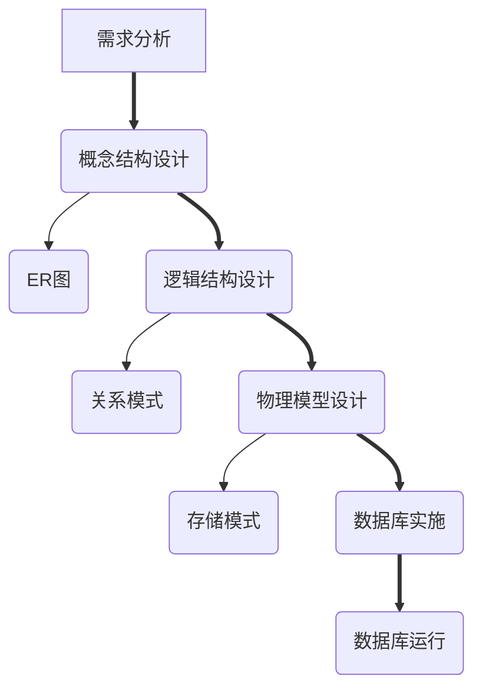

# 概念
表（关系）：那个二维表
属性（字段）：表下的各个键
记录（元组）：具体插入的数据
关系键：PRIMARY KEY
分量：记录中某个单个属性的那格
域：CHECK 范围

# 语法
创建表：CREATE TABLE Dept
(
Dno char (2) PRIMARY KEY,
Dept varchar (30) UNIQUE NOT NULL,
Dean varchar (10),
Address varchar (40)
);

更新键：ALTER TABLE T
FOREIGN KEY (Dno) REFERENCES Dept(Dno) ON UPDATE CASCADE;

更新记录：UPDATE Dept SET Dno='06' WHERE Dno='01';

删除记录：DELETE FROM table_name WHERE condition;

使用表：USE table_name;

查看所有库：SHOW DATABASES;

查看表定义：SHOW CREATE TABLE table_name;

查看表结构：DESC table_name;

查看库结构：SHOW TABLES; 

查看记录：SELECT * FROM table_name;

# 级联更新
before: ![[CS/附件/image.png]]

UPDATE Dept SET Dno='06' WHERE Dno='01';--更新 Dept (Dno)

later: ![[CS/附件/image-1.png]]

# 各种模式

**外模式 = 用户看到的；概念模式 = 整体逻辑；内模式 = 硬盘怎么存**

---

## 1. 外模式（用户模式 / 子模式）

**你能看到的局部数据**

- 给用户、应用程序用
- 只看自己需要的那一部分
- 一个数据库可以有**很多个**外模式
- 对应选项：**B 外模式 / C 外部模式**

👉 考试看到：**用户视图、查询、局部数据 → 选外模式**

---

## 2. 概念模式（逻辑模式）

**整个数据库的整体逻辑结构**

- 全公司 / 全系统统一的数据结构
- 只有**一个**
- 数据库的**核心**
- 对应选项：**B 概念模式 / C 逻辑模式 / A 模式**

👉 考试看到：**整体结构、核心、逻辑 → 选概念模式（逻辑模式）**

---

## 3. 内模式（存储模式）

**数据在硬盘上怎么存**

- 底层存储方式、索引、文件结构
- 只有**一个**
- 对用户完全透明
- 对应选项：**D 内模式 / D 内部模式 / A 存储模式**

👉 考试看到：**存储、物理、硬盘、文件 → 选内模式**

# 数据独立性

数据独立性 = **数据和程序分开，改数据不用改程序**
1. 人工管理数据和程序绑死，换个数据程序就废 → 独立性最差
2. 文件系统稍微好一点，但还是很容易乱，改文件程序就得改 → 一般
3. 数据库系统数据统一管理，程序不用管数据怎么存、怎么改 → 独立性最高
4. 数据项管理，根本不是阶段，是干扰项！

# 各种数据库系统

# **IMS → 第一代数据库（层次模型）**

- **全称**：Information Management System
- **地位**：**世界上最早的数据库**
- **类型**：**第一代数据库（层次型）**
- **考试必记**：看到 **IMS = 第一代数据库**

---

# **SYBASE → 关系型数据库（商用大型库）**

- 老牌**关系型数据库**
- 和 Oracle、SQL Server 一类
- **不是第一代**，是后来的商业库

---

# **Ingres → 关系型数据库（研究型鼻祖）**

- 早期**关系型数据库**
- 是很多现代数据库的 “爷爷”
- **不是第一代**

---

# **OODBS → 面向对象数据库**

- **全称**：Object-Oriented Database System
- **第三代数据库**
- 跟对象、类有关，**完全不是第一代**

# 数据库可以存储声音、图片、视频

- 声音、图片、视频在数据库里叫**二进制大对象（BLOB）**
- 现在的数据库（MySQL、Oracle、SQL Server）全都支持

# 关系模型

## 一、核心名词（考试必考）

- **关系**：一张**二维表**
- **元组**：表中的**一行**（也叫**记录**）
- **属性**：表中的**一列**（也叫**字段**）
- **分量**：某一行某一列的**一个值**
- **域**：属性的取值范围

---

## 二、关系的 4 个特点（背！）

1. **列是同质的**：同一列数据类型一样
2. **列名唯一**：不能有两列同名
3. **行、列顺序无关**：调换顺序不影响
4. **任意两行不能完全相同**（重点）

---

## 三、键（码）

- **候选码**：能**唯一**标识一行的属性 / 组合
- **主码**：从候选码里**选一个**当主键（一个关系至多一个主键，可以没有）
- **外码**：引用别的表的主码，用来连表

# 连接字符串

- concat (字符串 1, 字符串 2, ...)直接拼一起，不加分隔符例：concat ('My','SQL') → MySQL
- concat_ws (分隔符，字符串 1, 字符串 2, ...)用指定符号把后面所有字符串隔开例：concat_ws ('-','My','SQL') → My-SQL

# 数据对象的（)，授权子系统就越灵活

范围越小 → 控制越细 → 授权越灵活

# 并发

多个用户**同时**操作同一个数据库，就叫**并发**。

- **丢失修改**（两个人同时改，一个人的修改被覆盖）
- **读脏数据**（读到别人没提交的、错误的数据）
- **不可重复读**（同一次查询，两次结果不一样）

# 索引按存放位置分

- 聚集索引（Clustered Index）数据直接存在索引叶子节点，表数据按索引顺序物理排序✅ 一张表只能有一个聚集索引
- 非聚集索引（Non-Clustered Index）索引和数据分开存放，索引只存指向数据的地址✅ 一张表可以有多个非聚集索引

聚集索引：索引和数据在一起
非聚集索引：索引和数据分开

# [[#语法]]

# 关系的完整性。

- **实体完整性**：主码唯一且非空，保证元组可唯一标识。
- **参照完整性**：外码取值要么为空，要么等于被参照关系的主码值。
- **用户定义完整性**：根据业务需求自定义的约束条件。

# 合并查询

对两个**相同属性**表的合并

1. **UNION** —— 合并，并**自动去重**
2. **UNION ALL** —— 合并，**不去重**（更快）
3. **INTERSECT** —— 取**交集**（只留两边都有的）
4. **EXCEPT** —— 取**差集**（只留左边有、右边没有的）

# 教材整理
## 数据管理技术（特点）
### 人工管理阶段
- **无专用软件**：程序员用卡片/磁带，自己管理数据
- **数据不保存**：程序结束，数据消失
- **高度依赖程序**：数据与程序绑定，无法共享
### 文件系统管理阶段
- **文件长期保存**：数据存储在磁盘文件中
- **操作系统管理**：通过文件系统 API 访问
- **共享差、冗余高**：以文件为单位共享，数据重复存储且不一致
### 数据库系统管理阶段
- **结构化、共享高**：按数据模型组织，多用户并发访问
- **数据独立**：三级模式+两级映像，物理/逻辑独立性
- **统一控制**：DBMS 提供安全、完整、并发、恢复机制
### 高级数据库阶段
- **应对大数据/高并发**：NoSQL（高扩展）、NewSQL（强一致+扩展）
- **云原生/多模型**：存算分离、支持多种数据模型
- **灵活一致性**：从 ACID 到 BASE，按需选择
## 三级模式结构（三级模式+二级映像功能/优点）
从内到外分别是：
- 内模式（存储模式）
- 概念模式（逻辑模式）
- 外模式（用户模式）
### 内模式（Internal Schema / 存储模式）
- **定义**：描述数据在数据库内部**实际如何存储**。它是最接近物理存储的一层。
- **关注点**：存储记录、索引方式（B+树、哈希）、数据压缩、数据块大小、存储路径等。
- **作用**：处理“数据存在磁盘的哪个扇区？用什么索引？”这类物理细节。
- **对应对象**：物理数据库。
### 2. 概念模式（Conceptual Schema / 逻辑模式）
- **定义**：描述数据库中**全部数据的逻辑结构**和特征。它是数据库管理员视角下的**公共数据视图**。
- **关注点**：有哪些表、表中有哪些字段、数据类型、长度、表之间的主外键关系、业务规则约束等。
- **作用**：屏蔽内模式的物理存储细节，只描述“存了什么数据，数据之间是什么关系”。
- **对应对象**：基本表（Base Table）。
### 3. 外模式（External Schema / 用户模式 / 子模式）
- **定义**：**某个用户或应用程序**所能看到和操作的那部分数据的逻辑结构。它是概念模式的子集。
- **关注点**：不同用户（如财务部、人事部）需要的数据视图可能不同，甚至可以屏蔽某些字段（如工资、密码）。
- **作用**：提供数据安全性和使用便利性，用户无需关心不相关的数据。
- **对应对象**：视图（View）或授权给用户的表部分。

> 1.内模式:
> 。数据按B+树索引I存储，数据块大小为8KB，学生表按学号字段散列
> 存储。
> 2.概念模式：
> 。学生表(学号，姓名，年龄，专业，家庭收入)
> 课程表(课程号，课程名，学分)
> 3.外模式：
> 。学生处用户视图：可看学生表的学号、姓名、专业、家庭收入（用
> 于助学金评定）。
> 。教师用户视图：可看学生表的学号、姓名、年龄，隐藏家庭收入。
> 。选课系统视图：可看学生表的学号、姓名，以及课程表全部信息。
## 二级映像
| 映像名称         | 连接的两端      | 主要作用           | 实现的独立性      | 典型变更场景                     |
| ------------ | ---------- | -------------- | ----------- | -------------------------- |
| **外模式/概念模式** | 外模式 ↔ 概念模式 | 将用户视图映射到全局逻辑结构 | **逻辑数据独立性** | 合并表、拆分表、增减字段、修改关系约束        |
| **概念模式/内模式** | 概念模式 ↔ 内模式 | 将逻辑结构映射到物理存储结构 | **物理数据独立性** | 改变索引类型、更换硬盘、调整存储块大小、改变压缩算法 |

理解两级映像的关键：**它们使得应用程序只需要关心自己需要的那部分数据（外模式），而不必关心数据是如何逻辑组织（概念模式）和物理存储（内模式）的**。当物理或逻辑结构优化调整时，只需修改映像，应用程序无需重写。

意思是自己部分的程序用不变，上一步调整了只要通过映像映射过来还是一样的接口就行

> 假设**没有**映像，程序员写 `SELECT name FROM student`，结果 DBA 把 `student` 表改成了 `students`，程序立刻报错。  
> 有了映像之后，DBA 只需要把“外模式的 `student`”映射到“概念模式的 `students`”，程序依然正常运行。
## 数据库设计概述（功能/优点）

## E-R模型
### 核心要素

| 要素     | 图形表示 | 含义                         | 例子（学生选课系统）              |
| ------ | ---- | -------------------------- | ----------------------- |
| **实体** | 矩形   | 客观存在的、可相互区分的事物（可对应到数据库中的表） | 学生、课程、教师、学院             |
| **属性** | 椭圆形  | 实体或联系所具有的特征或性质（可对应到表中的字段）  | 学号、姓名、年龄、学分             |
| **联系** | 菱形   | 实体与实体之间的业务关联关系             | 选修（学生与课程之间）、讲授（教师与课程之间） |
### 联系类型

| 联系类型         | 图形表示（在菱形连线旁标注） | 含义                                           | 例子                              |
| ------------ | -------------- | -------------------------------------------- | ------------------------------- |
| **1：1**（一对一） | 1：1            | 实体A中的一个实体，最多对应实体B中的一个实体；反之亦然                 | 班级——班长（一个班级只有一个班长，一个班长只能属于一个班级） |
| **1：N**（一对多） | 1：N            | 实体A中的一个实体，可以对应实体B中的多个实体；反之，B中一个实体最多对应A中的一个实体 | 班级——学生（一个班级有多个学生，一个学生只属于一个班级）   |
| **M：N**（多对多） | M：N            | 实体A中的一个实体，可以对应实体B中的多个实体；反之亦然                 | 学生——课程（一个学生选修多门课程，一门课程被多个学生选修）  |
### E-R 模型 → 关系模型（表）的转换规则

| E-R模型中的元素  | 转换为关系模型中的内容                | 特殊处理                            |
| ---------- | -------------------------- | ------------------------------- |
| **实体**     | 一张表                        | 实体的属性成为表的字段，标识符成为主键             |
| **1：1 联系** | 可将一方的**主键**放进另一方表中作为**外键** | 也可单独建表，但不常用                     |
| **1：N 联系** | 将“1”端的主键放入“N”端表中作为**外键**   | 最常用、最标准的方式                      |
| **M：N 联系** | **必须新建一张独立的关系表**           | 表中包含双方实体的主键（联合主键）以及联系自身的属性（如成绩） |
## 逻辑模型的设计（3种特点）
## 关系模型的术语
关系、属性、域、元组、分量、基数、码、关系模式、关系数据库
## 完整性约束（功能，辨析哪部分完整性）
- 实体完整性
- 参照完整性
- 用户定义完整性
## 视图（定义/与表比较优缺点/不同与相同）
定义：视图是从一个或多个基本表（或视图）中导出的表

| 维度            | 表（Table / 基表）     | 视图（View）               |
| ------------- | ----------------- | ---------------------- |
| **本质**        | 物理存在的数据结构         | 虚拟的查询逻辑（一段SQL）         |
| **数据存储**      | **实际存储**数据，占用物理空间 | **不存储**数据，只存储SQL定义     |
| **增删改**       | 直接操作              | **有很大限制**，很多视图不可更新     |
| **数据同步**      | 修改即生效，永久保存        | 每次查询时**动态生成**，实时反映基表变化 |
| **依赖关系**      | 独立存在              | 依赖于基表，基表删除则视图失效        |
| **存储空间**      | 占用磁盘空间            | 几乎不占用（只存定义）            |
| **数据读取速度**    | 快（直接读数据）          | 可能慢（每次执行SQL）           |
| **数据写入（增删改）** | ✅ 完全支持            | ⚠️ 有限制，很多不可写           |
| **建立索引**      | ✅ 可建多种索引          | ❌ 不能（物化视图除外）           |
| **封装复杂逻辑**    | ❌ 需自己写复杂SQL       | ✅ 对外隐藏复杂度              |
| **权限控制粒度**    | 列/行权限需额外设置        | ✅ 天然按视图切分              |
| **表结构变化的影响**  | 直接影响应用            | 可屏蔽部分变化（修改视图即可）        |
| **调试和排错**     | 直观                | 多层视图时较麻烦               |
### 相同点
1. **使用方式一致**：对用户/应用程序来说，查询视图和查询表的 SQL 语法完全相同（都是用 `SELECT ... FROM ...`），从使用体验上，用户通常感觉不到正在操作的是视图还是表。
2. **可以出现在 SQL 语句的相同位置**：视图和表都可以出现在 `SELECT` 的 `FROM` 子句中，也可以出现在 `JOIN` 子句中（视图可以与其他表或视图进行连接查询）。
3. **都可以定义列名和数据类型**：视图的列名和数据类型来自其定义查询中的源表或计算表达式，最终呈现给用户时和表一样是一张二维表结构。
4. **都可以进行权限控制**：两者都可以对用户授予或撤销查询、插入、更新、删除等权限（尽管视图的更新权限受限）。
5. **都是数据库的对象**：两者都作为数据库中的模式对象被创建、存储和管理，可以用 `CREATE`、`DROP` 等 DDL 语句操作。
### 优先使用表的场景
·需要持久存储数据
·频繁进行增删改操作
·对查询性能要求极高，需要索引优化
·数据量巨大
### 优先使用视图的场景
·封装复杂的多表查询，让业务代码更简洁
·不同用户需要看到同一份数据的不同子集(不同列或不同行)
·需要屏蔽敏感字段
·提供稳定的接口，屏蔽底层表结构的变化(数据独立性)
·报表系统中，预定义常用查询模板
## 索引（定义/优点）
**索引**是数据库中**一种独立的、物理的数据库结构**，它是表中**一列或若干列的值**与其物理存储位置（行 ID、指针）之间的一种**排序后的映射关系**。

**核心本质**：索引是对表中数据的一种**排序后的快速查找结构**，通过它可以**直接定位**到满足条件的数据位置，而不需要逐行扫描整张表。

**索引是一种通过空间换时间、排序换查找的数据结构，其核心优点就是极大加速数据检索，同时能辅助排序、分组和唯一性约束。**

| 优点                              | 说明与例子                                                                                                                                                                     |
| ------------------------------- | ------------------------------------------------------------------------------------------------------------------------------------------------------------------------- |
| **大幅提高查询速度**                    | 这是索引最主要、最直观的优点。对于大表，有索引和无索引的查询速度可能相差几个数量级。例如 `SELECT * FROM user WHERE id = 123`，id列如果有唯一索引，数据库可以立即定位到该行；如果没有，则需要逐行扫描整个表。                                                 |
| **加速连接查询（JOIN）**                | 当对两个表进行连接查询时，如果在连接条件（ON子句）涉及的列上建立索引，可以显著提升JOIN的效率，避免多层嵌套扫描。                                                                                                               |
| **加速分组（GROUP BY）和排序（ORDER BY）** | 索引本身已经按顺序存储了值。当执行 `GROUP BY` 或 `ORDER BY` 操作时，数据库可以直接利用索引的顺序，避免额外的、开销很大的文件排序（filesort）操作。                                                                                 |
| **保证数据的唯一性**                    | 创建**唯一索引**（`UNIQUE INDEX`）可以强制要求索引列中的每个值都是唯一的，从而在数据库层面防止数据重复。这比应用层检查更加可靠。例如，为用户的“身份证号”列创建唯一索引，可以确保不会录入两个相同的身份证号。                                                          |
| **提高聚合函数效率**                    | 对于 `MAX()`、`MIN()` 这类聚合函数，如果作用列上有索引，数据库可以直接从索引的两端获取最大值或最小值，而无需扫描全表。对于 `COUNT()` 函数，某些数据库的优化器也能利用索引快速统计。                                                                   |
| **利用“覆盖索引”避免回表**                | 这是更高阶的优化。如果索引中**已经包含了**查询所需要的**所有列**，那么数据库只需要读取索引本身就能得到结果，**无需再访问**数据表（即“回表”），这会带来极致的性能提升。例如，索引是 `(id, name)`，查询 `SELECT name FROM user WHERE id = 5`，数据库直接查索引就能拿到`name`。 |
## 事务（概念/特性/作用）
### 概念
**事务**是数据库执行过程中的一个**逻辑工作单元**，它由**一组操作序列**组成，这些操作要么全部成功执行，要么全部不执行，不会出现“执行了一半”的情况。

**事务**是数据库管理系统中执行工作的一个最小、不可再分的工作单元。它通常以 `BEGIN TRANSACTION` 开始，以 `COMMIT`（提交，确认所有更改）或 `ROLLBACK`（回滚，撤销所有更改）结束。

> 例子：银行转账 
> 从 A 账户向 B 账户转账 100 元。  
> 这个业务包含两个操作：
> 1. `UPDATE Account SET balance = balance - 100 WHERE name = 'A';`    
> 2. `UPDATE Account SET balance = balance + 100 WHERE name = 'B';`

事务就是要把这两个操作**捆绑在一起**，成为一个整体。它不允许出现“A 的钱扣了，B 的钱却没加上”这种中间状态。
### 事务的四大特性（ACID）
|特性|英文|含义|保证/解决|
|---|---|---|---|
|**原子性**|**Atomicity**|事务中的所有操作，要么**全部完成**，要么**全部不完成**。不存在部分成功、部分失败的情况。如果执行中发生错误，所有已执行的操作都会回滚到事务开始前的状态。|保证操作不可分割|
|**一致性**|**Consistency**|事务必须使数据库从一个**一致的状态**转变到另一个**一致的状态**。事务执行前后，数据的完整性约束（如外键、唯一索引、业务规则）都不会被破坏。|保证数据的完整性|
|**隔离性**|**Isolation**|多个事务**并发执行**时，一个事务的执行不应被其他事务干扰。每个事务都感觉不到其他事务在同时执行，仿佛自己是唯一在操作数据库的。|解决并发访问问题|
|**持久性**|**Durability**|一旦事务**提交**成功，它对数据库所做的修改就**永久保存**下来。即使之后发生系统崩溃、断电或重启，这些修改也不会丢失。|保证数据不丢失|
### 作用
1. **保证数据的一致性和正确性**  
    这是事务最根本的作用。在复杂的业务场景中，数据之间存在各种逻辑约束（如库存不能为负、账户收支平衡）。事务通过保证“要么全做，要么全不做”，防止了因系统错误、断电或操作失败而导致的**数据不一致**。
2. **简化编程模型**  
    如果没有事务，程序员需要自己处理各种异常、断电、并发冲突等复杂情况，代码会极其复杂且容易出错。事务提供了一个高级抽象：程序员只需要把一系列操作标记为一个事务，数据库系统就会自动负责处理中间状态的所有复杂问题。
3. **实现并发控制**  
    在多用户同时访问数据库时，事务的隔离性能够防止各种并发问题，如**脏读**（读到其他事务未提交的数据）、**不可重复读**（同一事务内两次读同一记录结果不同）、**幻读**（读到了其他事务新插入的数据）等。开发者只需设置事务的隔离级别，数据库便可以通过锁或多版本并发控制（MVCC）等机制来保证并发环境下的数据正确性。
4. **提供故障恢复能力**  
    结合日志机制，事务是实现系统故障后快速恢复的基础。未提交的事务可以被回滚撤销；已提交的事务可以通过重做日志（Redo Log）来恢复，确保持久性。